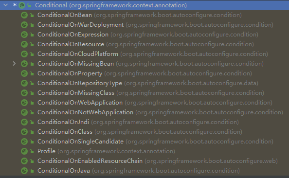

SpringBoot学习笔记

1. 

2. 注册组件:

   - 在config类文件中，使用@Configuration注解生成一个配置类，在配置类文件中注册组件@Bean

   ```Java
   @Configuration(proxyBeanMethods = true)// 告诉springboot这是一个配置类
   public class MyConfig {
       @Bean // 给容器中添加组件，以方法名作为组件id，返回类型就是组建类型，返回组件在容器中的实例
       public User User01(){
           User zhangsan = new User("张三", "18");
           zhangsan.setPet(tomcatPet());
           return zhangsan;
       }
   
       @Bean("tom")  // 以tom为组件名，而不是默认的方法名
       public Pet tomcatPet(){
           return new Pet("tomcat");
       }
   }
   ```

   ​	在IOC容器中注册了一个名为User01，一个tom的组件，通过@Configuration后面的proxyBeanMethods来控制容器中的对象是否是单例

   

   - @Bean、@Component、@Controller、@Service、@Repository

     

   - 通过@Import注解给容器导入组件，给容器中自动创造出这两个类型的组件,默认的组件名就是全类名

   ```Java
   @Import({User.class, DBHelper.class}) // 导入指定类型组件
   ```

   

   - @Conditional：条件装配，通过满足Conditional的条件，注入组件

   

   ```Java
   @Bean("tom")  // 以tom为组件名，而不是默认的方法名
   public Pet tomcatPet(){
       return new Pet("tomcat");
   }
   
   @ConditionalOnBean(name = "tom")
   @Bean // 给容器中添加组件，以方法名作为组件id，返回类型就是组建类型，返回的值就是组件在容器中的实例
   public User User01(){
       User zhangsan = new User("张三", "18");
       zhangsan.setPet(tomcatPet());
       return zhangsan;
   }
   ```

   ​	@ConditionalOnBean(name = "tom")表示如果容器中具有名为“tom”的组件，则在容器中注入名为User1的组件

   ​	需要注意的是，在容器中需要tom组件注册在前，@Conditional注解才会生效，否则无论怎么样都是不会注入User01的组件

   

   - 

3. as

