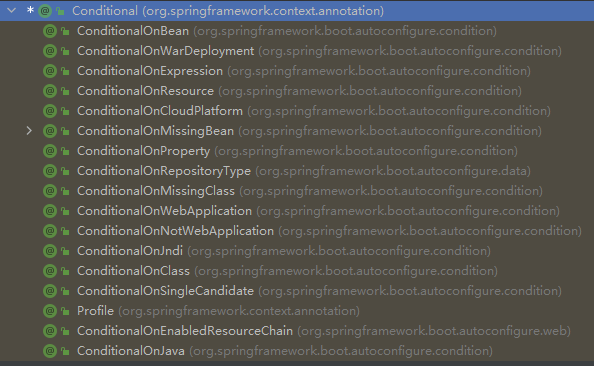

# SpringBoot学习笔记——基础入门

1. 

2. 注册组件:

   - @Configuration：在config类文件中，生成一个配置类，在配置类文件中使用@Bean注解注册组件

   ```Java
   @Configuration(proxyBeanMethods = true)// 告诉springboot这是一个配置类
   public class MyConfig {
       @Bean // 给容器中添加组件，以方法名作为组件id，返回类型就是组建类型，返回组件在容器中的实例
       public User User01(){
           User zhangsan = new User("张三", "18");
           zhangsan.setPet(tomcatPet());
           return zhangsan;
       }
   
       @Bean("tom")  // 以tom为组件名，而不是默认的方法名
       public Pet tomcatPet(){
           return new Pet("tomcat");
       }
   }
   ```

   ​	在IOC容器中注册了一个名为User01，一个tom的组件，通过@Configuration后面的proxyBeanMethods来控制容器中的对象是否是单例

   

   - @Bean、@Component、@Controller、@Service、@Repository

     

   - @Import：给容器导入组件，容器中自动创造出这两个类型的组件,默认的组件名就是全类名

   ```Java
   @Import({User.class, DBHelper.class}) // 导入指定类型组件
   ```

   

   - @Conditional：条件装配，通过满足Conditional的条件，注入组件

   

   ```Java
   @Bean("tom")  // 以tom为组件名，而不是默认的方法名
   public Pet tomcatPet(){
       return new Pet("tomcat");
   }
   
   @ConditionalOnBean(name = "tom")
   @Bean // 给容器中添加组件，以方法名作为组件id，返回类型就是组建类型，返回的值就是组件在容器中的实例
   public User User01(){
       User zhangsan = new User("张三", "18");
       zhangsan.setPet(tomcatPet());
       return zhangsan;
   }
   ```

   ​	@ConditionalOnBean(name = "tom")表示如果容器中具有名为“tom”的组件，则在容器中注入名为User1的组件

   ​	需要注意的是，在容器中需要tom组件注册在前，@Conditional注解才会生效，否则无论怎么样都是不会注入User01的组件

   

   - @ImportResource()：引入xml配置文件

     ```java
     @ImportResource("classpath:bean.xml")
     ```

     将bean.xml配置文件中注册的组件引入

     

3. 配置绑定 —— 读取properties文件中的内容，并将其封装到JavaBean中

   - @ConfigurationProperties

     

   - @EnableConfigurationProperties + @ConfigurationProperties：只能在配置类中写

     ```java
     // MyConfig.java
     	@EnableConfigurationProperties(Car.class) // 开启Car的属性配置绑定功能;把组件自动注册到容器中
     
     // class Car
     	@ConfigurationProperties(prefix="mycar")	//prefix对应properties文件中的属性前缀名
     	public class Car{
     		private String brand;
     		private Integer price;
     	} 
     ```

     

   - @Component + @ConfigurationProperties：给容器中的组件引入配置项

     ```Java
     // class Car
     	@Component   // 需要将组件注册到容器中，只有这样才能拥有SpringBoot的功能
     	@ConfigurationProperties(prefix="mycar")	//prefix对应properties文件中的属性前缀名
     	public class Car{
     		private String brand;
     		private Integer price;
     	} 
     	
     // application.properties
     	mycar.brand= BYD
     	mycar.price = 100000
     ```

     

4. 自动配置原理入门

   - 引导加载自动配置类

     ```Java
     // @SpringBootApplication注解中包含的注解
     @SpringBootConfiguration
     @EnableAutoConfiguration
     @ComponentScan(
         excludeFilters = {
     		@Filter(type = FilterType.CUSTOM,classes = {TypeExcludeFilter.class}),
     		@Filter(type = FilterType.CUSTOM,classes = {AutoConfigurationExcludeFilter.class})
     	}
     )
     ```

     - @SpringBootConfiguration

       注解中包含@Configuration注解，表明Main函数是一个配置类

     - @ComponentScan

       指定扫描哪些，详见Spring注解

     - @EnableAutoConfiguration

       ```java
       // @EnableAutoConfiguration注解中包含的注解
           @AutoConfigurationPackage
           @Import({AutoConfigurationImportSelector.class})
       	public @interface EnableAutoConfiguration {}
       ```

       

       - @AutoConfigurationPackage

       ```Java
       @Import({AutoConfigurationPackages.Registrar.class})  
       // 利用register给容器中导入一系列组件
       // 将指定的一个包下的所有组件导入进来，即MainApplication所在的包下的所有组件
       public @interface AutoConfigurationPackage {}
       ```

       - @Import({AutoConfigurationImportSelector.class})

       ```java
       // 利用getAutoConfigurationEntry()给容器批量导入组件
       ```

       ```properties
       文件里面写死了spring-boot一启动就要加载的所有配置类
       spring-boot-autoconfigure-2.3.4.RELEASE.jar包里面的META-INF/spring.factories
       
       # Auto Configure
       org.springframework.boot.autoconfigure.EnableAutoConfiguration=\
       org.springframework.boot.autoconfigure.admin.SpringApplicationAdminJmxAutoConfiguration,\
       org.springframework.boot.autoconfigure.aop.AopAutoConfiguration,\
       org.springframework.boot.autoconfigure.amqp.RabbitAutoConfiguration,\
       org.springframework.boot.autoconfigure.batch.BatchAutoConfiguration,\
       org.springframework.boot.autoconfigure.cache.CacheAutoConfiguration,\
       org.springframework.boot.autoconfigure.cassandra.CassandraAutoConfiguration,\
       org.springframework.boot.autoconfigure.context.ConfigurationPropertiesAutoConfiguration,\
       org.springframework.boot.autoconfigure.context.LifecycleAutoConfiguration,\
       org.springframework.boot.autoconfigure.context.MessageSourceAutoConfiguration,\
       org.springframework.boot.autoconfigure.context.PropertyPlaceholderAutoConfiguration,\
       org.springframework.boot.autoconfigure.couchbase.CouchbaseAutoConfiguration,\
       org.springframework.boot.autoconfigure.dao.PersistenceExceptionTranslationAutoConfiguration,\
       org.springframework.boot.autoconfigure.data.cassandra.CassandraDataAutoConfiguration,\
       org.springframework.boot.autoconfigure.data.cassandra.CassandraReactiveDataAutoConfiguration,\
       org.springframework.boot.autoconfigure.data.cassandra.CassandraReactiveRepositoriesAutoConfiguration,\
       org.springframework.boot.autoconfigure.data.cassandra.CassandraRepositoriesAutoConfiguration,\
       org.springframework.boot.autoconfigure.data.couchbase.CouchbaseDataAutoConfiguration,\
       org.springframework.boot.autoconfigure.data.couchbase.CouchbaseReactiveDataAutoConfiguration,\
       org.springframework.boot.autoconfigure.data.couchbase.CouchbaseReactiveRepositoriesAutoConfiguration,\
       org.springframework.boot.autoconfigure.data.couchbase.CouchbaseRepositoriesAutoConfiguration,\
       org.springframework.boot.autoconfigure.data.elasticsearch.ElasticsearchDataAutoConfiguration,\
       org.springframework.boot.autoconfigure.data.elasticsearch.ElasticsearchRepositoriesAutoConfiguration,\
       org.springframework.boot.autoconfigure.data.elasticsearch.ReactiveElasticsearchRepositoriesAutoConfiguration,\
       org.springframework.boot.autoconfigure.data.elasticsearch.ReactiveElasticsearchRestClientAutoConfiguration,\
       org.springframework.boot.autoconfigure.data.jdbc.JdbcRepositoriesAutoConfiguration,\
       org.springframework.boot.autoconfigure.data.jpa.JpaRepositoriesAutoConfiguration,\
       org.springframework.boot.autoconfigure.data.ldap.LdapRepositoriesAutoConfiguration,\
       org.springframework.boot.autoconfigure.data.mongo.MongoDataAutoConfiguration,\
       org.springframework.boot.autoconfigure.data.mongo.MongoReactiveDataAutoConfiguration,\
       org.springframework.boot.autoconfigure.data.mongo.MongoReactiveRepositoriesAutoConfiguration,\
       org.springframework.boot.autoconfigure.data.mongo.MongoRepositoriesAutoConfiguration,\
       org.springframework.boot.autoconfigure.data.neo4j.Neo4jDataAutoConfiguration,\
       org.springframework.boot.autoconfigure.data.neo4j.Neo4jRepositoriesAutoConfiguration,\
       org.springframework.boot.autoconfigure.data.solr.SolrRepositoriesAutoConfiguration,\
       org.springframework.boot.autoconfigure.data.r2dbc.R2dbcDataAutoConfiguration,\
       org.springframework.boot.autoconfigure.data.r2dbc.R2dbcRepositoriesAutoConfiguration,\
       org.springframework.boot.autoconfigure.data.r2dbc.R2dbcTransactionManagerAutoConfiguration,\
       org.springframework.boot.autoconfigure.data.redis.RedisAutoConfiguration,\
       org.springframework.boot.autoconfigure.data.redis.RedisReactiveAutoConfiguration,\
       org.springframework.boot.autoconfigure.data.redis.RedisRepositoriesAutoConfiguration,\
       org.springframework.boot.autoconfigure.data.rest.RepositoryRestMvcAutoConfiguration,\
       org.springframework.boot.autoconfigure.data.web.SpringDataWebAutoConfiguration,\
       org.springframework.boot.autoconfigure.elasticsearch.ElasticsearchRestClientAutoConfiguration,\
       org.springframework.boot.autoconfigure.flyway.FlywayAutoConfiguration,\
       org.springframework.boot.autoconfigure.freemarker.FreeMarkerAutoConfiguration,\
       org.springframework.boot.autoconfigure.groovy.template.GroovyTemplateAutoConfiguration,\
       org.springframework.boot.autoconfigure.gson.GsonAutoConfiguration,\
       org.springframework.boot.autoconfigure.h2.H2ConsoleAutoConfiguration,\
       org.springframework.boot.autoconfigure.hateoas.HypermediaAutoConfiguration,\
       org.springframework.boot.autoconfigure.hazelcast.HazelcastAutoConfiguration,\
       org.springframework.boot.autoconfigure.hazelcast.HazelcastJpaDependencyAutoConfiguration,\
       org.springframework.boot.autoconfigure.http.HttpMessageConvertersAutoConfiguration,\
       org.springframework.boot.autoconfigure.http.codec.CodecsAutoConfiguration,\
       org.springframework.boot.autoconfigure.influx.InfluxDbAutoConfiguration,\
       org.springframework.boot.autoconfigure.info.ProjectInfoAutoConfiguration,\
       org.springframework.boot.autoconfigure.integration.IntegrationAutoConfiguration,\
       org.springframework.boot.autoconfigure.jackson.JacksonAutoConfiguration,\
       org.springframework.boot.autoconfigure.jdbc.DataSourceAutoConfiguration,\
       org.springframework.boot.autoconfigure.jdbc.JdbcTemplateAutoConfiguration,\
       org.springframework.boot.autoconfigure.jdbc.JndiDataSourceAutoConfiguration,\
       org.springframework.boot.autoconfigure.jdbc.XADataSourceAutoConfiguration,\
       org.springframework.boot.autoconfigure.jdbc.DataSourceTransactionManagerAutoConfiguration,\
       org.springframework.boot.autoconfigure.jms.JmsAutoConfiguration,\
       org.springframework.boot.autoconfigure.jmx.JmxAutoConfiguration,\
       org.springframework.boot.autoconfigure.jms.JndiConnectionFactoryAutoConfiguration,\
       org.springframework.boot.autoconfigure.jms.activemq.ActiveMQAutoConfiguration,\
       org.springframework.boot.autoconfigure.jms.artemis.ArtemisAutoConfiguration,\
       org.springframework.boot.autoconfigure.jersey.JerseyAutoConfiguration,\
       org.springframework.boot.autoconfigure.jooq.JooqAutoConfiguration,\
       org.springframework.boot.autoconfigure.jsonb.JsonbAutoConfiguration,\
       org.springframework.boot.autoconfigure.kafka.KafkaAutoConfiguration,\
       org.springframework.boot.autoconfigure.availability.ApplicationAvailabilityAutoConfiguration,\
       org.springframework.boot.autoconfigure.ldap.embedded.EmbeddedLdapAutoConfiguration,\
       org.springframework.boot.autoconfigure.ldap.LdapAutoConfiguration,\
       org.springframework.boot.autoconfigure.liquibase.LiquibaseAutoConfiguration,\
       org.springframework.boot.autoconfigure.mail.MailSenderAutoConfiguration,\
       org.springframework.boot.autoconfigure.mail.MailSenderValidatorAutoConfiguration,\
       org.springframework.boot.autoconfigure.mongo.embedded.EmbeddedMongoAutoConfiguration,\
       org.springframework.boot.autoconfigure.mongo.MongoAutoConfiguration,\
       org.springframework.boot.autoconfigure.mongo.MongoReactiveAutoConfiguration,\
       org.springframework.boot.autoconfigure.mustache.MustacheAutoConfiguration,\
       org.springframework.boot.autoconfigure.orm.jpa.HibernateJpaAutoConfiguration,\
       org.springframework.boot.autoconfigure.quartz.QuartzAutoConfiguration,\
       org.springframework.boot.autoconfigure.r2dbc.R2dbcAutoConfiguration,\
       org.springframework.boot.autoconfigure.rsocket.RSocketMessagingAutoConfiguration,\
       org.springframework.boot.autoconfigure.rsocket.RSocketRequesterAutoConfiguration,\
       org.springframework.boot.autoconfigure.rsocket.RSocketServerAutoConfiguration,\
       org.springframework.boot.autoconfigure.rsocket.RSocketStrategiesAutoConfiguration,\
       org.springframework.boot.autoconfigure.security.servlet.SecurityAutoConfiguration,\
       org.springframework.boot.autoconfigure.security.servlet.UserDetailsServiceAutoConfiguration,\
       org.springframework.boot.autoconfigure.security.servlet.SecurityFilterAutoConfiguration,\
       org.springframework.boot.autoconfigure.security.reactive.ReactiveSecurityAutoConfiguration,\
       org.springframework.boot.autoconfigure.security.reactive.ReactiveUserDetailsServiceAutoConfiguration,\
       org.springframework.boot.autoconfigure.security.rsocket.RSocketSecurityAutoConfiguration,\
       org.springframework.boot.autoconfigure.security.saml2.Saml2RelyingPartyAutoConfiguration,\
       org.springframework.boot.autoconfigure.sendgrid.SendGridAutoConfiguration,\
       org.springframework.boot.autoconfigure.session.SessionAutoConfiguration,\
       org.springframework.boot.autoconfigure.security.oauth2.client.servlet.OAuth2ClientAutoConfiguration,\
       org.springframework.boot.autoconfigure.security.oauth2.client.reactive.ReactiveOAuth2ClientAutoConfiguration,\
       org.springframework.boot.autoconfigure.security.oauth2.resource.servlet.OAuth2ResourceServerAutoConfiguration,\
       org.springframework.boot.autoconfigure.security.oauth2.resource.reactive.ReactiveOAuth2ResourceServerAutoConfiguration,\
       org.springframework.boot.autoconfigure.solr.SolrAutoConfiguration,\
       org.springframework.boot.autoconfigure.task.TaskExecutionAutoConfiguration,\
       org.springframework.boot.autoconfigure.task.TaskSchedulingAutoConfiguration,\
       org.springframework.boot.autoconfigure.thymeleaf.ThymeleafAutoConfiguration,\
       org.springframework.boot.autoconfigure.transaction.TransactionAutoConfiguration,\
       org.springframework.boot.autoconfigure.transaction.jta.JtaAutoConfiguration,\
       org.springframework.boot.autoconfigure.validation.ValidationAutoConfiguration,\
       org.springframework.boot.autoconfigure.web.client.RestTemplateAutoConfiguration,\
       org.springframework.boot.autoconfigure.web.embedded.EmbeddedWebServerFactoryCustomizerAutoConfiguration,\
       org.springframework.boot.autoconfigure.web.reactive.HttpHandlerAutoConfiguration,\
       org.springframework.boot.autoconfigure.web.reactive.ReactiveWebServerFactoryAutoConfiguration,\
       org.springframework.boot.autoconfigure.web.reactive.WebFluxAutoConfiguration,\
       org.springframework.boot.autoconfigure.web.reactive.error.ErrorWebFluxAutoConfiguration,\
       org.springframework.boot.autoconfigure.web.reactive.function.client.ClientHttpConnectorAutoConfiguration,\
       org.springframework.boot.autoconfigure.web.reactive.function.client.WebClientAutoConfiguration,\
       org.springframework.boot.autoconfigure.web.servlet.DispatcherServletAutoConfiguration,\
       org.springframework.boot.autoconfigure.web.servlet.ServletWebServerFactoryAutoConfiguration,\
       org.springframework.boot.autoconfigure.web.servlet.error.ErrorMvcAutoConfiguration,\
       org.springframework.boot.autoconfigure.web.servlet.HttpEncodingAutoConfiguration,\
       org.springframework.boot.autoconfigure.web.servlet.MultipartAutoConfiguration,\
       org.springframework.boot.autoconfigure.web.servlet.WebMvcAutoConfiguration,\
       org.springframework.boot.autoconfigure.websocket.reactive.WebSocketReactiveAutoConfiguration,\
       org.springframework.boot.autoconfigure.websocket.servlet.WebSocketServletAutoConfiguration,\
       org.springframework.boot.autoconfigure.websocket.servlet.WebSocketMessagingAutoConfiguration,\
       org.springframework.boot.autoconfigure.webservices.WebServicesAutoConfiguration,\
       org.springframework.boot.autoconfigure.webservices.client.WebServiceTemplateAutoConfiguration
       ```

     

   - 按需开启自动配置项

     虽然我们127个场景的所有自动配置启动的时候默认全部加载，但是最终会按需配置。

     

   - 定制化修改自动配置

     

5. 最佳实践

   - 引入场景依赖

     https://docs.spring.io/spring-boot/docs/current/reference/html/using.html#using.build-systems.starters

   - 查看自动配置内容(可选项)

     - 手动分析，引入场景对应的自动配置一般都生效了
     - 配置文件中debug=true开启自动配置报告，Negative \ Postive

   - 是否需要修改

     - 参照文档修改配置项

       - https://docs.spring.io/spring-boot/docs/current/reference/html/application-properties.html#appendix.application-properties

       - 自己分析。xxxxProperties

     - 自定义加入或者替换组件

       - @Bean，@Component...

     - 自定义器 xxxxCustomizer

     - ...

       

6. 开发技巧

   - Lombok——自动生成JavaBean的getter、setter、consturctor

   ```xml
   # 引入依赖
   <dependency>
       <groupId>org.projectlombok</groupId>
       <artifactId>lombok</artifactId>
   </dependency>
   ```

   ```Java
   @Data // 自动生成Getter与Setter方法
   @ToString // 自动生成ToString方法
   @AllArgsConstructor // 自动生成全参构造器
   @NoArgsConstructor // 自动生成无参构造器
   @EqualsAndHashCode // 自动生成equals与hash方法
   @slf4j // 引入日志
   ```

   

   - dev-tools —— 热更新

   ```xml
   # 引入依赖
   <dependency>
       <groupId>org.springframework.boot</groupId>
       <artifactId>spring-boot-devtools</artifactId>
       <optional>true</optional>
   </dependency>
   ```

   ​	修改完代码以后，Ctrl+F9重新编译以后不需要重新启动Main函数即可使用

   

   - Spring Initializer

   

